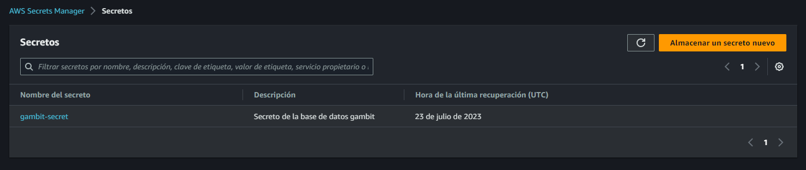
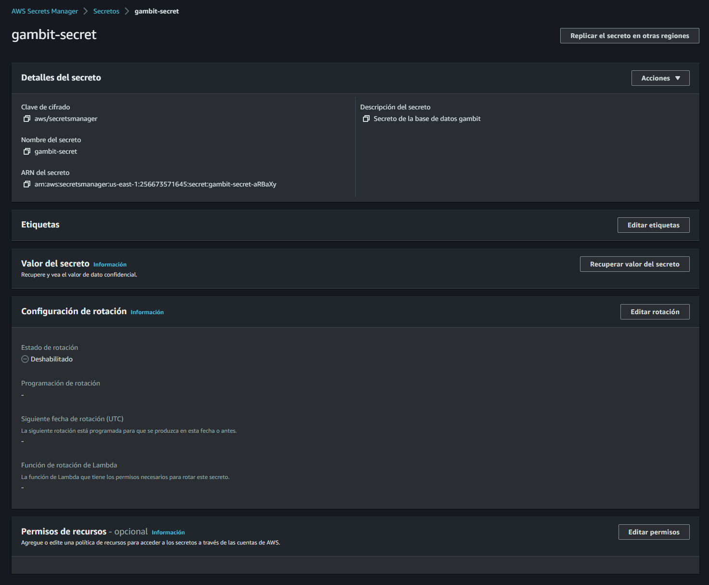
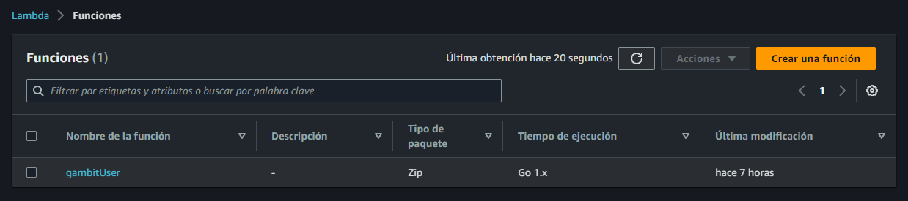
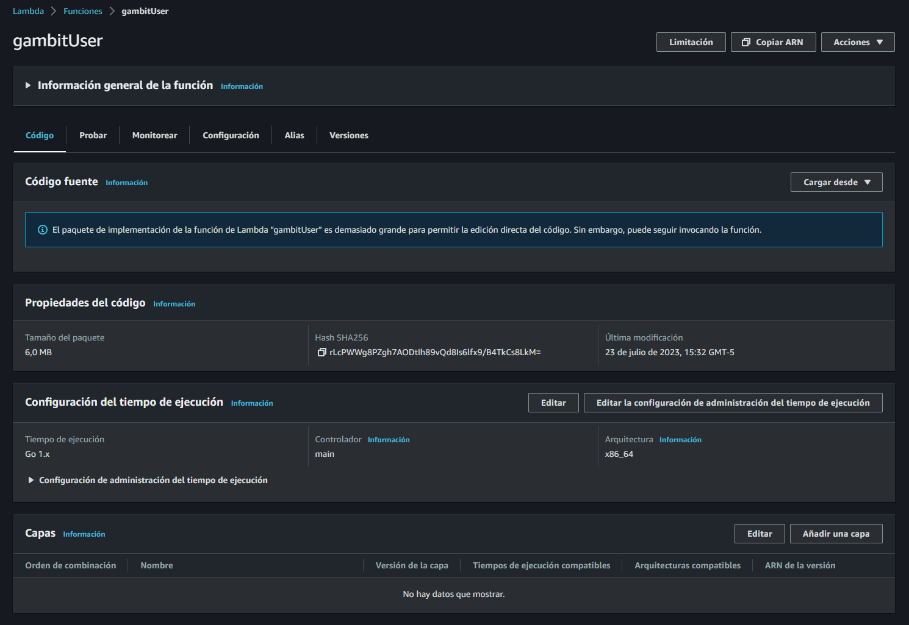
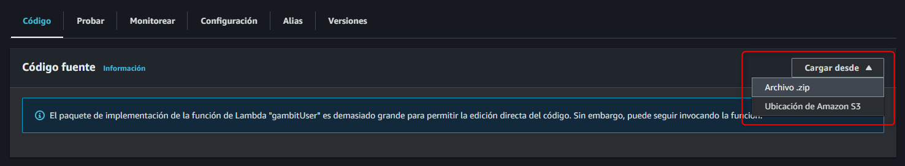
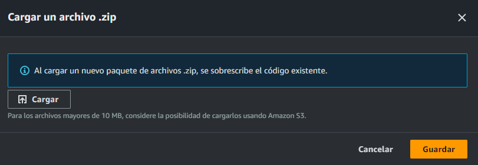

# Backend en Go

- [Backend en Go](#backend-en-go)
  - [Setup](#setup)
  - [Lambda en GO para manejo de usuarios](#lambda-en-go-para-manejo-de-usuarios)
  - [Desarrollo de paquete AWS Go](#desarrollo-de-paquete-aws-go)
  - [Desarrollo de paquete Models](#desarrollo-de-paquete-models)
  - [Desarrollo de paquete Secret Manager](#desarrollo-de-paquete-secret-manager)
  - [Desarrollo de paquete Tools completamos BD](#desarrollo-de-paquete-tools-completamos-bd)
  - [Compilar nuestro Lambda y subir a AWS](#compilar-nuestro-lambda-y-subir-a-aws)

## Setup

Chocolatey

- https://chocolatey.org/
- https://community.chocolatey.org/packages
- https://community.chocolatey.org/packages/gh

| Install          | Upgrade          |
| ---------------- | ---------------- |
| choco install gh | choco upgrade gh |

```BASH
choco install gh
choco upgrade gh
```

- https://github.com/cli/cli
- https://cli.github.com/manual/gh_repo_create

```BASH
git init
```

```BASh
gh repo create gambituser --public --source=. --remote=origin
```

```BASH
git remote -v

# origin  https://github.com/PCZeroX/gambituser.git (fetch)
# origin  https://github.com/PCZeroX/gambituser.git (push)
```

## Lambda en GO para manejo de usuarios

```BASH
go env
```

```BASH
go mod init github.com/pczerox/gambituser
```

```BASH
go get github.com/aws/aws-lambda-go/lambda
go get github.com/aws/aws-lambda-go/events
```

## Desarrollo de paquete AWS Go

```BASH
go get github.com/aws/aws-sdk-go-v2/aws
go get github.com/aws/aws-sdk-go-v2/config
```

`/awsgo/awsgo.go`

```GO
package awsgo

import (
	"context"

	"github.com/aws/aws-sdk-go-v2/aws"
	"github.com/aws/aws-sdk-go-v2/config"
)

var Ctx context.Context
var Cfg aws.Config
var err error

func StartAWS() {
	Ctx = context.TODO()
	Cfg, err = config.LoadDefaultConfig(Ctx, config.WithDefaultRegion(("us-east-1")))

	if err != nil {
		panic("Error al cargar la configuración .aws/config " + err.Error())
	}
}
```

## Desarrollo de paquete Models

`/models/models.go`

```GO
package models

type SecretRDSJson struct {
	Username            string `json:"username"`
	Password            string `json:"password"`
	Engine              string `json:"engine"`
	Host                string `json:"host"`
	Port                int    `json:"port"`
	DbClusterIdentifier string `json:"dbClusterIdentifier"`
}

type SignUp struct {
	UserEmail string `json:"UserEmail"`
	UserUUID  string `json:"UserUUID"`
}
```

`main.go`

```GO
package main

import (
	"context"
	"errors"
	"fmt"
	"os"

	"github.com/aws/aws-lambda-go/events"
	lambda "github.com/aws/aws-lambda-go/lambda"
	"github.com/pczerox/gambituser/awsgo"
)

func main() {
	lambda.Start(startLambda)
}

func startLambda(ctx context.Context, event events.CognitoEventUserPoolsPostConfirmation) (events.CognitoEventUserPoolsPostConfirmation, error) {
	awsgo.StartAWS()

	if !ValidParameters() {
		fmt.Println("Error en los parámetros. Debe enviar 'SecretName'")
		err := errors.New("error en los parámetros debe enviar SecretName")

		return event, err
	}
}

func ValidParameters() bool {
	var getParameter bool
	_, getParameter = os.LookupEnv("SecretName")

	return getParameter
}
```

## Desarrollo de paquete Secret Manager

```BASH
go get github.com/aws/aws-sdk-go-v2/service/secretsmanager
```

`/secretm/secretm.go`

```GO
package secretm

import (
	"encoding/json"
	"fmt"

	"github.com/aws/aws-sdk-go-v2/aws"
	"github.com/aws/aws-sdk-go-v2/service/secretsmanager"
	"github.com/pczerox/gambituser/awsgo"
	"github.com/pczerox/gambituser/models"
)

func GetSecret(secretName string) (models.SecretRDSJson, error) {
	var secretData models.SecretRDSJson

	fmt.Println(" > Pido Secreto " + secretName)

	svc := secretsmanager.NewFromConfig(awsgo.Cfg)

  // Le pasamos el puntero de secret manager
	key, err := svc.GetSecretValue(awsgo.Ctx, &secretsmanager.GetSecretValueInput{
		SecretId: aws.String(secretName),
	})

	if err != nil {
		fmt.Println(err.Error())
		return secretData, err
	}

  // Le pasamos el puntero de secret manager
	json.Unmarshal([]byte(*key.SecretString), &secretData)
	fmt.Println(" > Lectura de Secret OK" + secretName)

  return secretData, nil
}
```

**AWS Secrets Manager**

https://us-east-1.console.aws.amazon.com/secretsmanager/landing?region=us-east-1


https://us-east-1.console.aws.amazon.com/secretsmanager/listsecrets?region=us-east-1



https://us-east-1.console.aws.amazon.com/secretsmanager/secret?name=gambit-secret&region=us-east-1




```GO
func main() {
  // Create Secrets Manager client
	svc := secretsmanager.NewFromConfig(config)

	input := &secretsmanager.GetSecretValueInput{
		SecretId:     aws.String(secretName),
		VersionStage: aws.String("AWSCURRENT"), // VersionStage defaults to AWSCURRENT if unspecified
	}

	result, err := svc.GetSecretValue(context.TODO(), input)
	if err != nil {
		// For a list of exceptions thrown, see
		// https://docs.aws.amazon.com/secretsmanager/latest/apireference/API_GetSecretValue.html
		log.Fatal(err.Error())
	}
}
```

```BASH
go get github.com/go-sql-driver/mysql
```

`/db/common.go`

```GO
package db

import (
	"database/sql"
	"fmt"
	"os"

	_ "github.com/go-sql-driver/mysql"
	"github.com/pczerox/gambituser/models"
	"github.com/pczerox/gambituser/secretm"
)

var SecretModel models.SecretRDSJson
var err error
var Db *sql.DB

func ReadSecret() error {

	SecretModel, err = secretm.GetSecret(os.Getenv("SecretName"))
	return err
}

func DBConnect() error {
	Db, err = sql.Open("mysql", ConnStr(SecretModel))

	if err != nil {
		fmt.Println(err.Error())
		return err
	}

	err = Db.Ping()
	if err != nil {
		fmt.Println(err.Error())
		return err
	}

	fmt.Println("Conexión exitosa a la Base de Datos")
	return nil
}

func ConnStr(keys models.SecretRDSJson) string {
	var dbUser, authToken, dbEndpoint, dbName string
	dbUser = keys.Username
	authToken = keys.Password
	dbEndpoint = keys.Host
	dbName = keys.Dbname
	dsn := fmt.Sprintf("%s:%s@tcp(%s)/%s?allowCleartextPasswords=true", dbUser, authToken, dbEndpoint, dbName)
	fmt.Println(dsn)
	return dsn
}
```

`main.go`

```GO
package main

import (
	"context"
	"errors"
	"fmt"
	"os"

	"github.com/aws/aws-lambda-go/events"
	lambda "github.com/aws/aws-lambda-go/lambda"
	"github.com/pczerox/gambituser/awsgo"
	"github.com/pczerox/gambituser/db"
	"github.com/pczerox/gambituser/models"
)

func main() {
	fmt.Println("Iniciar proyecto gambitUser")

	lambda.Start(startLambda)
}

func startLambda(ctx context.Context, event events.CognitoEventUserPoolsPostConfirmation) (events.CognitoEventUserPoolsPostConfirmation, error) {
	awsgo.StartAWS()

	if !ValidParameters() {
		fmt.Println("Error en los parámetros. Debe enviar 'SecretName'")
		err := errors.New("error en los parámetros debe enviar SecretName")

		return event, err
	}

	var data models.SignUp

	for row, att := range event.Request.UserAttributes {
		switch row {
		case "email":
			data.UserEmail = att
			fmt.Println("Email = " + data.UserEmail)
		case "sub":
			data.UserUUID = att
			fmt.Println("Sub = " + data.UserUUID)
		}
	}

	err := db.ReadSecret()
	if err != nil {
		fmt.Println("Error al leer el Secret" + err.Error())
		return event, err
	}

	err = db.SignUp(data)
	return event, err
}

func ValidParameters() bool {
	var getParameter bool
	_, getParameter = os.LookupEnv("SecretName")

	return getParameter
}
```

## Desarrollo de paquete Tools completamos BD

```BASH
go get github.com/go-sql-driver/mysql
```

`/db/common.go`

```GO
package db

import (
	"database/sql"
	"fmt"
	"os"

	_ "github.com/go-sql-driver/mysql"
	"github.com/pczerox/gambituser/models"
	"github.com/pczerox/gambituser/secretm"
)

var SecretModel models.SecretRDSJson
var err error
var Db *sql.DB

func ReadSecret() error {

	SecretModel, err = secretm.GetSecret(os.Getenv("SecretName"))
	return err
}

func DBConnect() error {
	Db, err = sql.Open("mysql", ConnStr(SecretModel))

	if err != nil {
		fmt.Println(err.Error())
		return err
	}

	err = Db.Ping()
	if err != nil {
		fmt.Println(err.Error())
		return err
	}

	fmt.Println("Conexión exitosa a la Base de Datos")
	return nil
}

func ConnStr(keys models.SecretRDSJson) string {
	var dbUser, authToken, dbEndpoint, dbName string
	dbUser = keys.Username
	authToken = keys.Password
	dbEndpoint = keys.Host
	dbName = keys.Dbname
	dsn := fmt.Sprintf("%s:%s@tcp(%s)/%s?allowCleartextPasswords=true", dbUser, authToken, dbEndpoint, dbName)
	fmt.Println(dsn)
	return dsn
}
```

`/db/signup.go`

```GO
package db

import (
	"fmt"

	"github.com/pczerox/gambituser/models"
	"github.com/pczerox/gambituser/tools"
)

func SignUp(sig models.SignUp) error {
	fmt.Println("Comienza Registro")

	err := DBConnect()
	if err != nil {
		return err
	}

	//Confirma el cierre de la base de datos
	defer Db.Close()

	sentencia := "INSERT INTO users (User_Email, User_UUID, User_DateAdd) VALUES ('" + sig.UserEmail + "','" + sig.UserUUID + "','" + tools.FechaMySQL() + "')"

	fmt.Println(sentencia)
	_, err = Db.Exec(sentencia)
	if err != nil {
		fmt.Println(err.Error())
		return err
	}

	fmt.Println("SignUp > Ejecución Exitosa")
	return nil
}
```

`main.go`

```GO
package main

import (
	"context"
	"errors"
	"fmt"
	"os"

	"github.com/aws/aws-lambda-go/events"
	lambda "github.com/aws/aws-lambda-go/lambda"
	"github.com/pczerox/gambituser/awsgo"
	"github.com/pczerox/gambituser/db"
	"github.com/pczerox/gambituser/models"
)

func main() {
	fmt.Println("Iniciar proyecto gambitUser")

	lambda.Start(startLambda)
}

func startLambda(ctx context.Context, event events.CognitoEventUserPoolsPostConfirmation) (events.CognitoEventUserPoolsPostConfirmation, error) {
	awsgo.StartAWS()

	if !ValidParameters() {
		fmt.Println("Error en los parámetros. Debe enviar 'SecretName'")
		err := errors.New("error en los parámetros debe enviar SecretName")

		return event, err
	}

	var data models.SignUp

	for row, att := range event.Request.UserAttributes {
		switch row {
		case "email":
			data.UserEmail = att
			fmt.Println("Email = " + data.UserEmail)
		case "sub":
			data.UserUUID = att
			fmt.Println("Sub = " + data.UserUUID)
		}
	}

	err := db.ReadSecret()
	if err != nil {
		fmt.Println("Error al leer el Secret" + err.Error())
		return event, err
	}

	err = db.SignUp(data)
	return event, err
}

func ValidParameters() bool {
	var getParameter bool
	_, getParameter = os.LookupEnv("SecretName")

	return getParameter
}
```

## Compilar nuestro Lambda y subir a AWS

Configurar las variables de entorno

`.gitignore`

```BASH
main
main.zip
subo.bat
```

`subo.bat`

```BASH
git add .
git commit -m "Ultimo Commit"
git push
set GOOS=linux
set GOARCH=amd64
go build main.go
del main.zip
tar.exe -a -cf main.zip main
```

```BASH
subo.bat
```

https://us-east-1.console.aws.amazon.com/lambda/home?region=us-east-1



https://us-east-1.console.aws.amazon.com/lambda/home?region=us-east-1#/functions/gambitUser?tab=code







```BASH

```

```BASH

```

---
